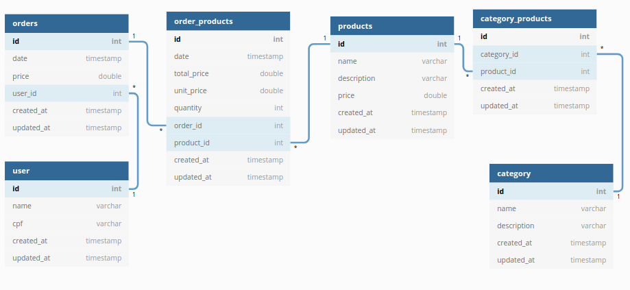

<h3 align="center">
 Solução das questões 4, 5 e 6: Vaga Desenvolvedor NodeJS A_AV
</h3>

<p align="center">
  <a href="#Quetão-4">Quetão 4</a>&nbsp;&nbsp;&nbsp;|&nbsp;&nbsp;&nbsp;
  <a href="#Quetão-5">Quetão 5</a>&nbsp;&nbsp;&nbsp;|&nbsp;&nbsp;&nbsp;
  <a href="#Quetão-6">Quetão 6</a>&nbsp;&nbsp;&nbsp;|&nbsp;&nbsp;&nbsp;
</p>


####  Quetão 4:
 Função para encontre a soma dos dígitos de um número usando recursão.

```C
int soma( int valor){
    
    if(valor <= 0){
        return 0;
    }
    
    return valor%10 + soma( valor/10);
}

```

####  Quetão 5: 
Função que imprime os números de 1 a 50. Mas para múltiplos de três imprime "Fizz" ao invés do número e para os múltiplos de cinco imprime "Buzz". Para números que são múltiplos de três e cinco, imprime "FizzBuzz"


```C
int main()
{
    int i;

    for (i=1; i<=50; i++){
        
        if(i%3==0 && i%5==0){
            printf("FizzBuzz\n");
        }
        
        else if(i%3==0){
            printf("Fizz\n");
        }
        
        else if(i%5==0){
            printf("Buzz\n");
        }
        else{
            printf("%d\n",i);
        }
    }
}


```


####  Quetão 6: 
Modelo de dados do mercado do João.

